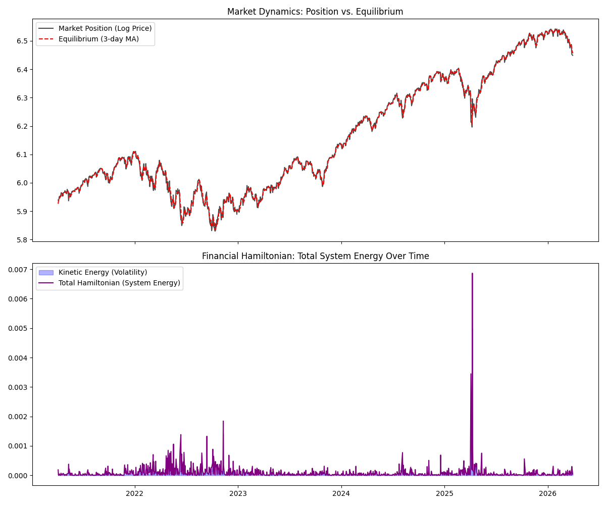
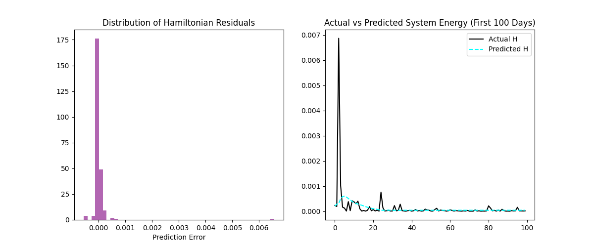

# FinancialHamiltonian
Treat market volatility as a dynamical system with energy constraints and long-term equilibrium states.

## Theoretical Bridge: Physics to Finance

In physics, a Hamiltonian H(p,q) represents the total energy of a system in terms of momentup (p) and position (q).
In finance, we can create a psuedo-Haniltonian where:

- position (q): The current price or log-returns of an asset.
- Momentum (p): the rate of change in colatility (the velocty of market fear).

By defining the price in this way, we are defining **conserved quantities** of the market.
Even if the market is chaotic, there are energy levels it tends to return to.

## Asymtotics and Steady States

Most ML models struggle with "drift"-the model works today but fails in six months due to market changes.
We use asymtotic anaylysis to find the limit of the model as t approaches infinity.

- Technique: Dominant balance analysis on volatility equations
- Goal: Identify Steady State (attractors). If the current market volatility is slightly excited from a steady state, I can predict the rate of decay back to equilibrium.
- Why it's smart: This model does not guess; it understands the underlying stability of the regime.

## Technical Workflow (Python + LSTM)

Work will be done in the Jupyter Notebook in the root of this directory.
Results are saved as in the project root as png's.

### Data Aquisition

We use the `yfinance` library to pull 10+ years of high-frequency data for a volitile index.
In this case we use **VIX**(Volatility Index).

### Feature: The "Physics" Layer

We calculate:

1. Kinetic Energy component ($K$): $1/2 m v^2$ where $v$ is the 5-day moving average of price change.
2. Potential Energy component ($V$): The distance from the 200-day moving average represents a restoring potential.
3. The Hamiltonian Feature: $H = K + V$

### The LSTM Architecture

LSTMs are well suited to this task because they have a memory that can capture the long-term dependencies we Identify in the asymptotic analysis.

## Results

--- Model Performance ---
Model RMSE: 0.000432
Naive RMSE: 0.000616
Improvement over Baseline: 29.88%